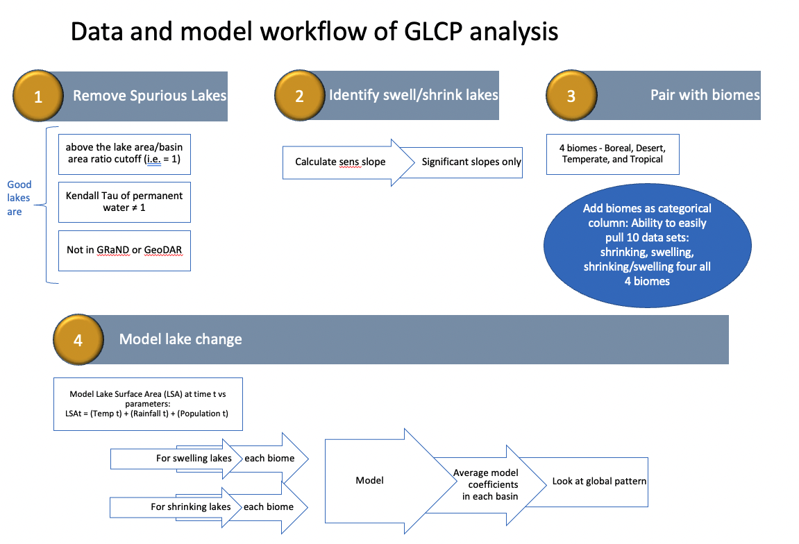

# GLCP-analysis

-----

:busts_in_silhouette: Ryan McClure, Alli Cramer, Steve Katz

:busts_in_silhouette: Special thanks to: Michael Meyer, Matt Brousil, and Stephanie Hampton

Questions?  :email: ryan.mcclure@wsu.edu

## Motivation

Thank you for checking out the GLCP analysis workflow. Lakes globally are both increasing and decreasing in size as a result of changing climate and human pressure. However, both the magnitude and spatial variation of how waterbody area is changing has been restricted to regional assesments and has not yet been quantified for lakes globally.

We developed a workflow that analyzes the magnitude and direction of lake area change for 1.4+ million lakes globally. We then isolated lakes that were increasing and decreasing in area across four WWF ecoregions and then quantified the importance of drivers. This is a first globally-scaled attempt to partition how lake area is chaning globally and to isolate the most important predictors of that change. 

### There are 4 major data processes currently in production. 

